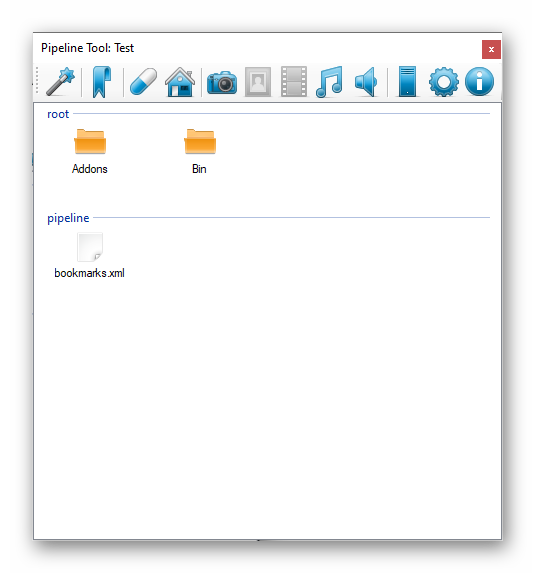

# Bookmarks

After checking the files and folders in Pipeline Tree
you can se some objects and categories inside bookmark view.

To go to bookmark view press this  and then you can see this panel:

- 1. Category is made by name of the parent folder. For example if a file is located in `pipeline\bin` folder then category that is going to be assign is `bin`
- 2. This is an item. If you double click an item it's going to open, lunch whatever it is - application, folder, website. Everything.
- 3. 
    - Every Item can be removed from Bookmarks View by clicking on it with right mouse button.
    - When you press once with left click the full path of the item corresponding file or folder is copied to the `clipboard`.