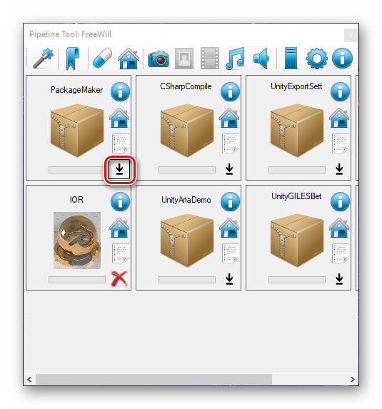
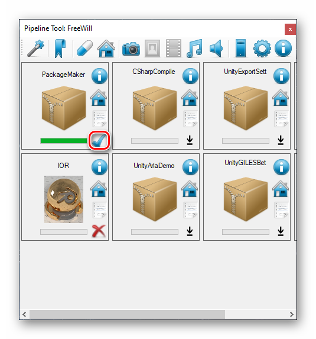
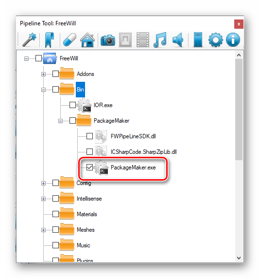
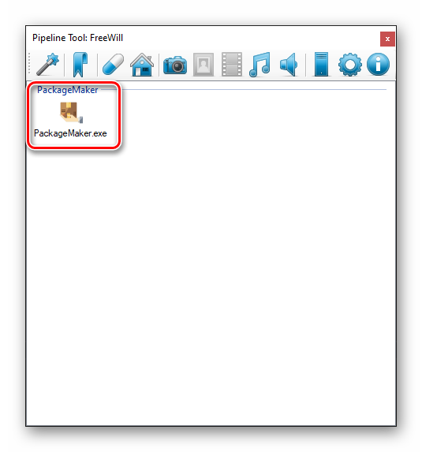
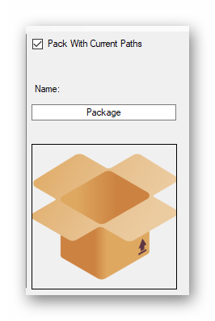

# How Create package for Pipeline?

You can create does packages via PackageMaker avaiable in `FWPipeline Packages`.

### Install Package
Fist install package from `Packages` Tab.

Click on download button and wait for it to finish.

This icon shows finished process:-)

### Running The App

Find the app in `Bin` directory of your `pipeline tree`.

Good practice is to check the apps so you can find it easier later.
`Double Click` to lunch it or if you checked it find `Maker` in your `bookmarks`.

### Using Package Maker
The App is really straight forward add files from multiple directories from `contextual` menu or `file` menu.
If you want to reset list of files just click on `File->New`

On This Big White box you can check the files/folders that been added.
To delete -> just select and press `Delete` button.

Most importand is right panel:

- `Pack With Current Paths` means that `Everything` will be unpacked in pipeline root structure.
    Example:
        - You have folder X. With two files and two folders. The folder X will be inside pipeline root.
        - If you uncheck it you can chose the folder inside your pipeline. And Folder X will be unpacked inside that selected folder.
- `Name` well enter name of the package.
- `Image` This big image is a button press it and see magic happens.

The Package is going to be saved at pipeline root. You can upload it to your server. More [here](settings.md).

