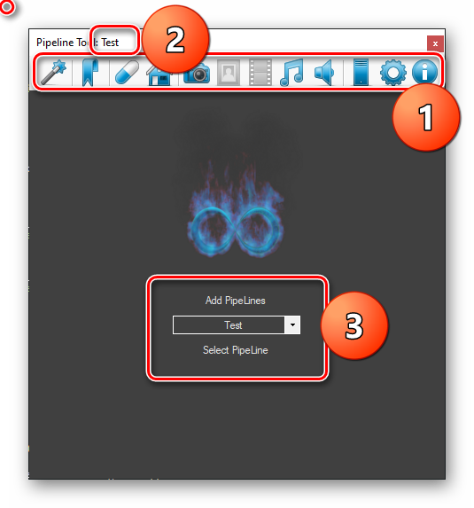

# Home Page
Here you can select and add Pipelines to your system.

- 1. ToolBar
- 2. After `:` is the name of the current selected pipeline.
- 3. 
    - Add Pipelines allow you to select folder and mark it as pipeline path.
    - Chose pipeline with Select Box and press `Select Pipeline`

When changing or adding new pipeline admin rights are necessary. 

