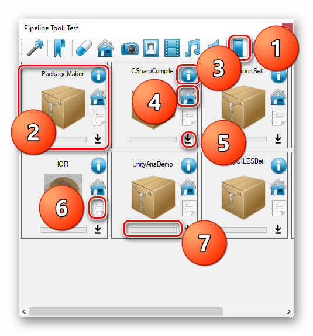
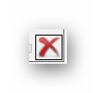

# Packages

Packages are zip files with small manifest that can be placed on server.
If in settings you specify secondary adress for manifest then both FW and your repository packages will be seen in this view.

- 1. Select Packages View.
- 2. Package Thumbnail.
- 3. Information about package. Like Version & description.
- 4. Application Home Page.
- 5. Download Button. If download is completed then icon change to this:  and if you just open this view and software detect packages then this icon shows up: . If it's not the black icon then it acts as delete button.
- 6. ChangeLog usually a page with version changes.
- 7. Progress bar for downloads.

To Create packages you need to have a `PackageMaker` tool. This tool can be downloaded from `Packages`.