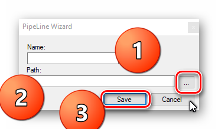
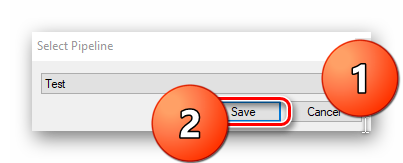
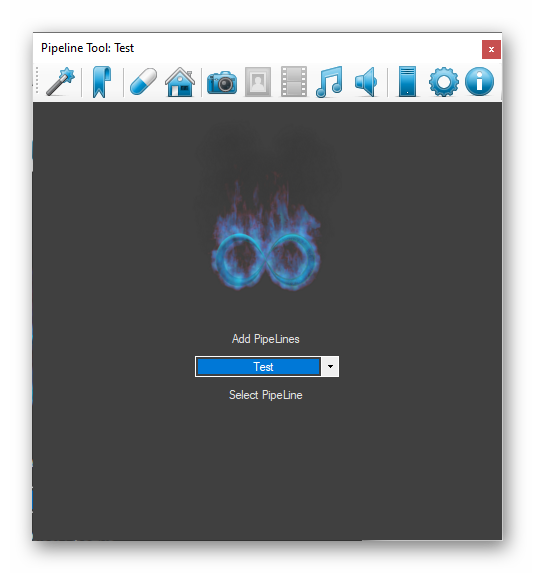

# QuickStart

## The Installation

Download the FWPipeline tool from [here](https://fwstorage.imfast.io/FWPipeLine/Apps/FWPipeline.rar).
Unpack it.

## Launch

First launch is very easy just launch the app by clicking the FWPipeline.exe. During Initial setup you can be asked by UAC multiple times to proceed. Just click yes. Admin rights are necessary to setup Environment Variables that this software uses. Thanks to that library can always find the pipeline and it's tools no matter what application use it. 

This screen shows up:

  - 1. Write Name of The Pipeline (Can be different than selected folder name)     
  - 2. Chose Folder where to store the pipeline files.
  - 3. After everything set, save it:-)

After clicking save new popup appears:

  - 1. Chose Pipeline (created one should be selected).
  - 2. Click Save.

And after all that hassle the application should be ready to use.

