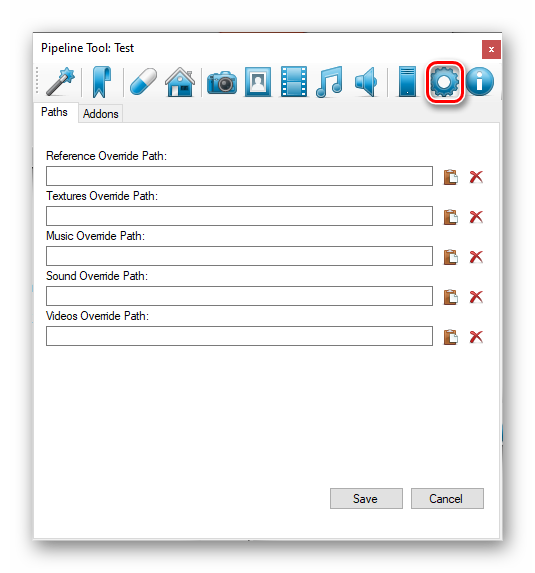
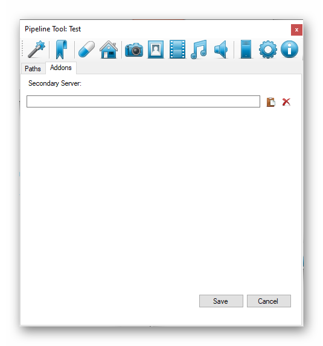

# Settings

Some simple settings for the pipeline.



Press this `cog icon` and the settings screen will shows up.
Here you can change the folder paths for the views.
If you override them and press `Save` everything should be scaned for files for corresponding views.



On `Addons` tab you can specify secondary package server manifest. Needs to be https or local/network file.
Something like: `https://some_sample_url/packages/manifest.xml` or `C:\manifest.xml`.
Example manifest:

```xml
<?xml version="1.0" encoding="UTF-8" ?> 
<items>
  <item name="Package">
    <version>1.0</version>   
    <description>Description</description>
    <url>https://some_sample_url/packages/package.zip</url> 
    <changelog>changelog url</changelog> 
    img url</img>
    <help>help url</help>
  </item> 
</items>
```

To Create packages you need to have a `PackageMaker` tool. This tool can be downloaded from `Packages`.