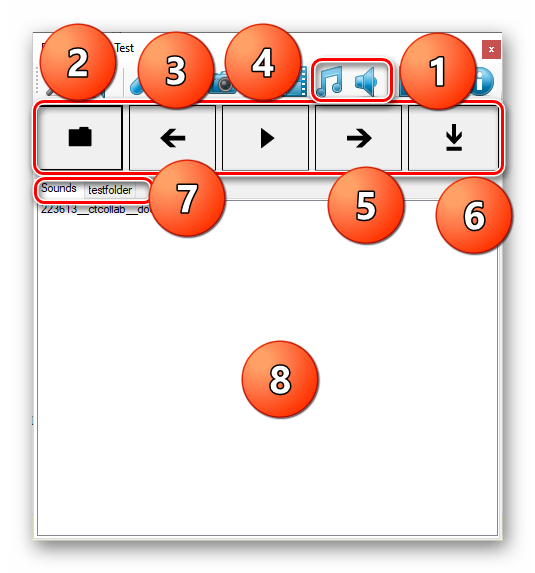

# Music & Sound View

This view allows you to chose from selected samples and copy it to `clipboard`.

- 1. Chose Music or Sound Category
- 2. Shows current sample in explorer.
- 3. Select Previews Sample.
- 4. Play Sample.
- 5. Select Next Sample.
- 6. Copy Sample to `clipboard`.
- 7. Categories are the child folder names of the music/sound folder.
- 8. List of samples in current category(folder).