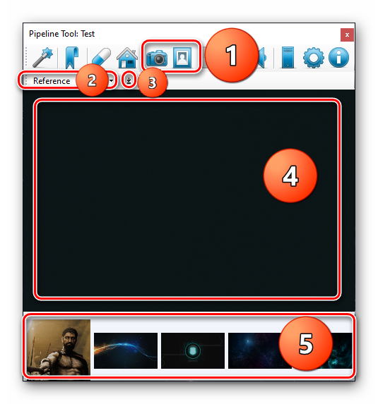

# Texture and Reference View

This View is for any type of images. It can preview them and copy them to your `clipboard`.

- 1. Chose texture or reference view.
- 2. Categories are made by child folders names. If none or images are at root of the current view path their category name will be the name of the current view - `Textures` or `Reference`. 
- 3. Copy to clipboard button. This will copy not the path but image itself. so you can copy image file to any software you like.
- 4. Bigger Image Preview
- 5. Current category image library. You can scroll them using mouse `scrollwheel`.