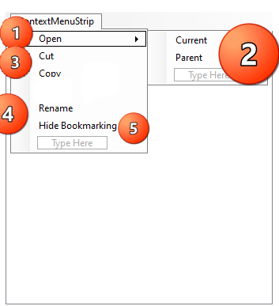
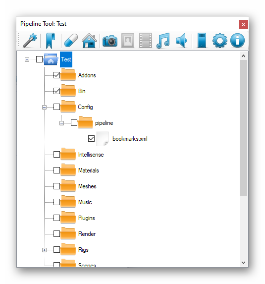
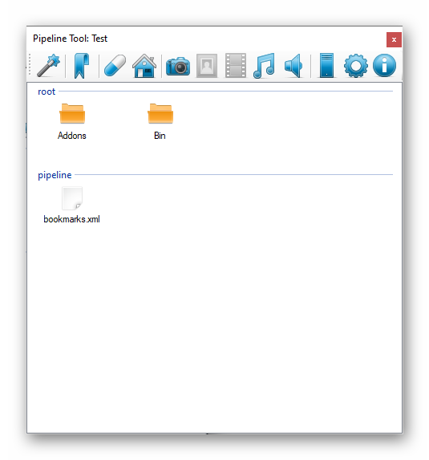

# Pipeline Tree

Pipeline Tree allows you to see hole pipeline structure. Copy files and mark them to bookmarks.
Wich allow you to quickly access selected tools, files or folders.

That blue icon is the pipeline root folder. You can open it. But you can't bookmark it or copy it.
When you press the right mouse button this contextual menu appears:

- 1. Open menu
- 2. 
    - You can open current selected node like file or folder.
    - Or you can open it's parent.
- 3. Copy file/folder to clipboard.
- 4. Rename file/folder
- 5. Show/Hide CheckBoxes for bookmarking. Every checked object will be shown in Bookmark Tab.

Below is a example of checked bookmark:

And this is how it looks in bookmark view:

